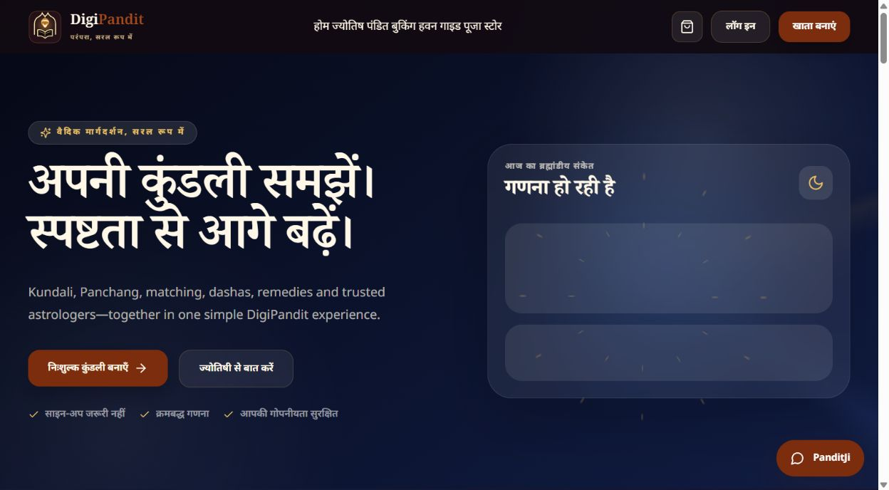
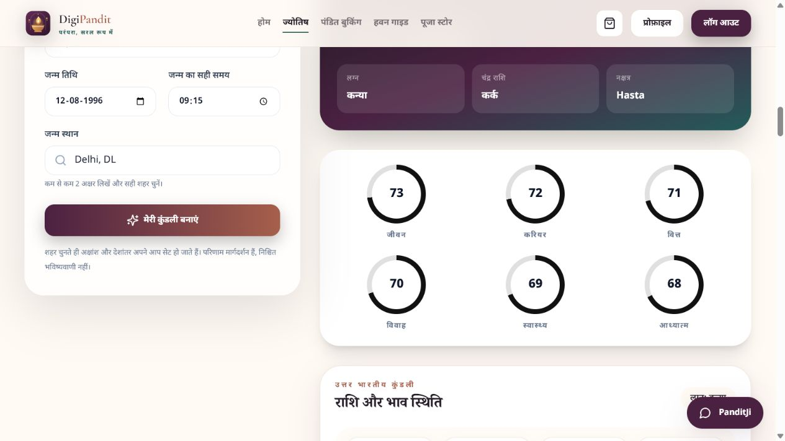
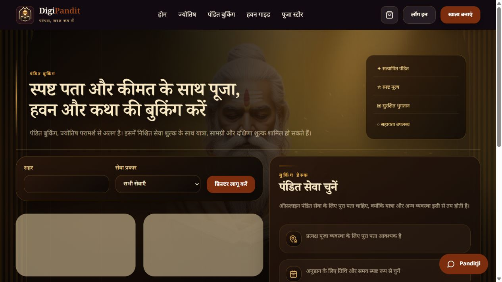
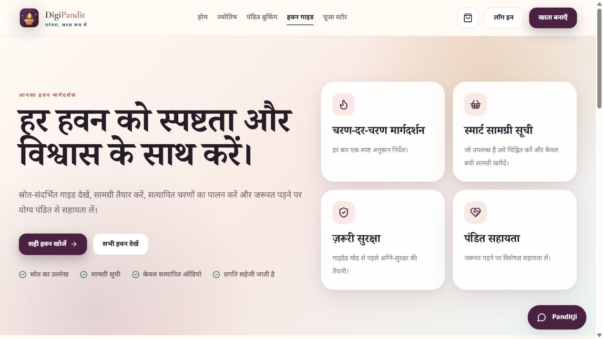
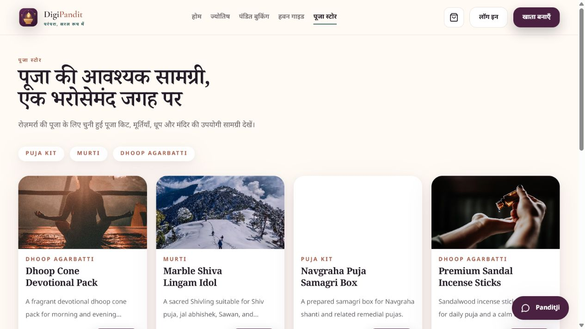
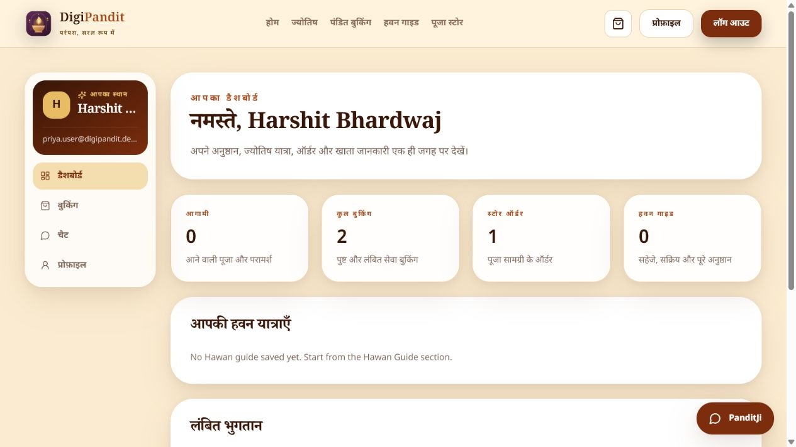
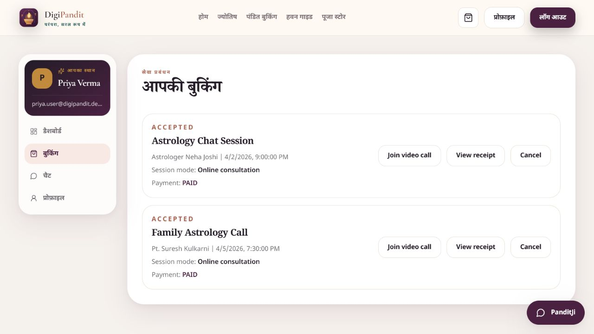
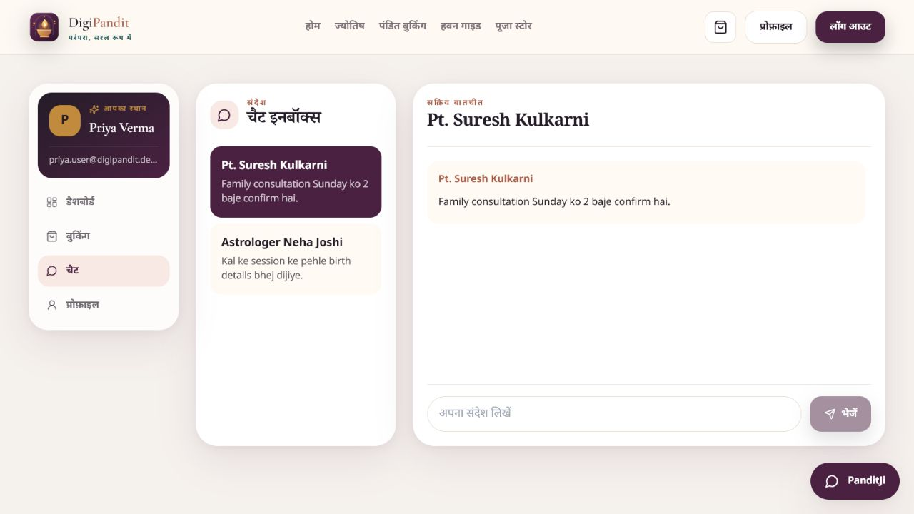
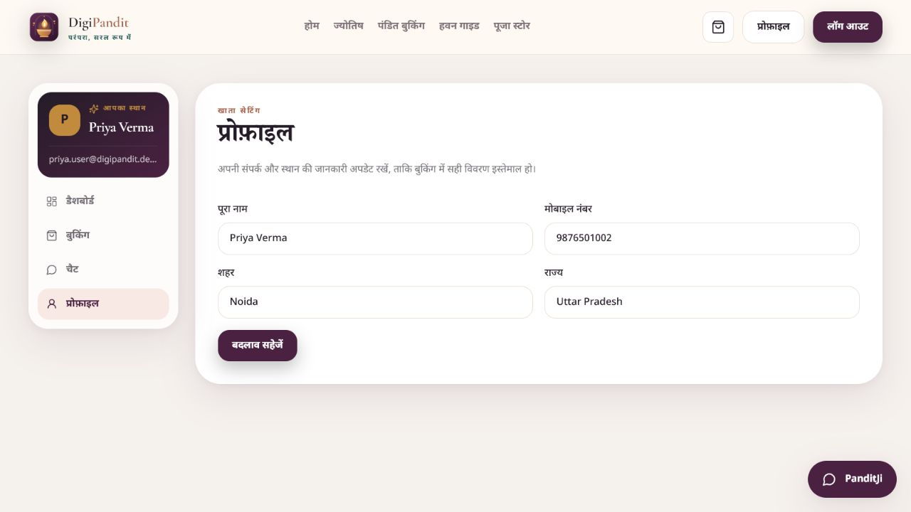
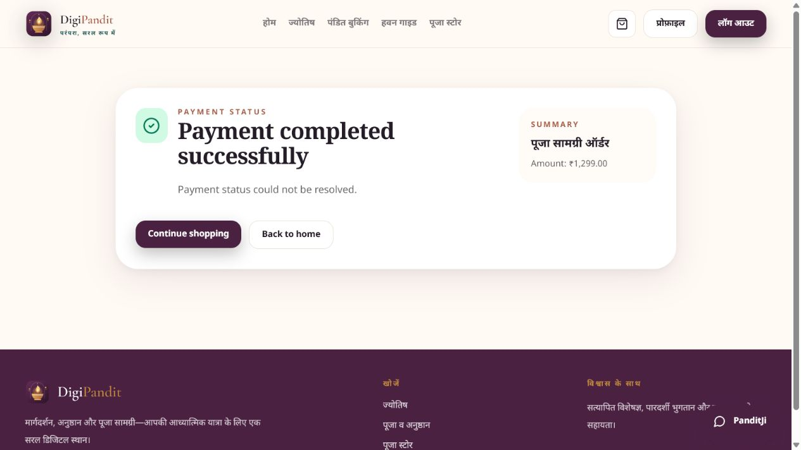

# DigiPandit

<p align="center">
  <strong>A digital platform for pandit bookings, astrology, guided Hawans, and puja essentials.</strong>
</p>

<p align="center">
  <a href="https://digipandit-web.vercel.app"><strong>View live website</strong></a>
  &nbsp;·&nbsp;
  <a href="https://digipandit-api.vercel.app/api/health"><strong>API health</strong></a>
  &nbsp;·&nbsp;
  <a href="#local-development">Run locally</a>
</p>

<p align="center">
  
  
  
  
</p>

## Live deployment

| Service | URL |
| --- | --- |
| Web app | [digipandit-web.vercel.app](https://digipandit-web.vercel.app) |
| Backend API | [digipandit-api.vercel.app](https://digipandit-api.vercel.app) |
| API health check | [Open health check](https://digipandit-api.vercel.app/api/health) |

## Overview

DigiPandit brings spiritual services into one modern, Hindi-first experience. Users can discover pandits and astrologers, browse puja essentials, book services, use the guided Hawan experience, and manage their activity from one dashboard.

The project is organised as a practical full-stack monorepo with a React frontend, an Express API, and MongoDB persistence.

## Highlights

- Pandit booking with city and service filters
- Astrology hub and Kundali experience
- Puja-store catalogue, cart, checkout flow, and order management
- Guided Hawan library with safety confirmation, materials, steps, progress, and source attribution
- User dashboard for profile, bookings, Hawan progress, and chat
- Role-based backend APIs for users, pandits, and administrators
- Email verification, authentication, validation, rate limiting, and CORS controls
- Responsive Hindi user interface
- Production deployment on Vercel with MongoDB Atlas

## Product gallery

All gallery images are cropped product screenshots.

| Home | Astrology |
| --- | --- |
|  |  |

| Kundali | Pandit booking |
| --- | --- |
|  |  |

| Hawan guide | Puja store |
| --- | --- |
|  |  |

| Dashboard | Bookings |
| --- | --- |
|  |  |

| Chat | Profile |
| --- | --- |
|  |  |

| Payment status |
| --- |
|  |

## Architecture

```text
React + Vite web app
        |
        | HTTPS / REST API
        v
Express API on Vercel
        |
        +-- Authentication and role checks
        +-- Pandit, booking, Hawan, store, chat and payment domains
        |
        v
MongoDB Atlas
```

## Repository structure

```text
.
├── backend/                 # Express API, models, routes, seeders and serverless entry
├── web/                     # React + Vite frontend
├── mobile/                  # Mobile project source
├── docs/
│   ├── deployment/          # Vercel deployment notes
│   └── screenshots/         # Product gallery screenshots
└── README.md
```

## Technology

| Layer | Stack |
| --- | --- |
| Frontend | React 18, Vite, Redux Toolkit, Tailwind CSS |
| Backend | Node.js, Express, Mongoose, Socket.IO |
| Database | MongoDB / MongoDB Atlas |
| Authentication | JWT, bcrypt, email OTP workflows |
| Media and email | Cloudinary and Nodemailer |
| Payments | PayU integration |
| Hosting | Vercel |

## Local development

### Prerequisites

- Node.js 18+
- npm
- MongoDB locally or a MongoDB Atlas connection string

### 1. Install dependencies

```bash
cd backend
npm install

cd ../web
npm install
```

### 2. Configure environment variables

Create `backend/.env` from the documented values below. Never commit real secrets.

```env
NODE_ENV=development
PORT=5000
MONGO_URI=mongodb://127.0.0.1:27017/digipandit
CLIENT_URL=http://localhost:5173
CORS_ORIGINS=http://localhost:5173
JWT_SECRET=replace-with-a-long-random-secret
JWT_EXPIRES_IN=7d
```

For the web app, create `web/.env`:

```env
VITE_API_URL=http://localhost:5000/api
VITE_SOCKET_URL=http://localhost:5000
```

Add SMTP, Cloudinary, PayU, and admin values only when you need those integrations. See [`docs/deployment/vercel.md`](docs/deployment/vercel.md) for production configuration.

### 3. Seed catalog data

The safe catalog seeder adds public showcase pandits and store products only. It does not create customer accounts, bookings, chats, orders, or admin credentials.

```bash
cd backend
npm run seed:catalog
```

Additional development seeders:

```bash
npm run seed:hawans
npm run seed:demo
```

### 4. Start the applications

In separate terminals:

```bash
# Terminal 1
cd backend
npm run dev
```

```bash
# Terminal 2
cd web
npm run dev
```

Open `http://localhost:5173`.

## Useful API endpoints

| Method | Endpoint | Description |
| --- | --- | --- |
| `GET` | `/api/health` | API health status |
| `POST` | `/api/auth/register` | User registration |
| `POST` | `/api/auth/login` | User login |
| `GET` | `/api/pandits` | Approved pandit listing |
| `GET` | `/api/products` | Active product listing |
| `GET` | `/api/hawans` | Published Hawan guides |
| `GET` | `/api/astrology/daily` | Daily astrology data |

## Deployment

The frontend and backend are independently deployed on Vercel:

- Frontend root directory: `web`
- Backend root directory: `backend`
- Frontend variables: `VITE_API_URL`, `VITE_SOCKET_URL`
- Backend variables: `MONGO_URI`, `CLIENT_URL`, `CORS_ORIGINS`, `JWT_SECRET`, and integration credentials as needed

Detailed instructions: [`docs/deployment/vercel.md`](docs/deployment/vercel.md)

## Security notes

- Keep `.env` files out of Git.
- Use a strong, unique `JWT_SECRET` in every environment.
- Restrict MongoDB Atlas network access appropriately for production.
- Use production payment credentials only after callback URLs and signatures are verified.
- Rotate any credential that may have appeared in a terminal, screenshot, or chat.

## License

Released under the [MIT License](LICENSE).
